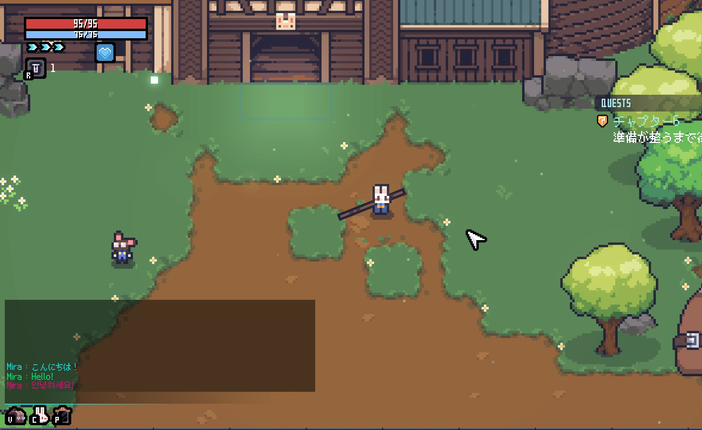
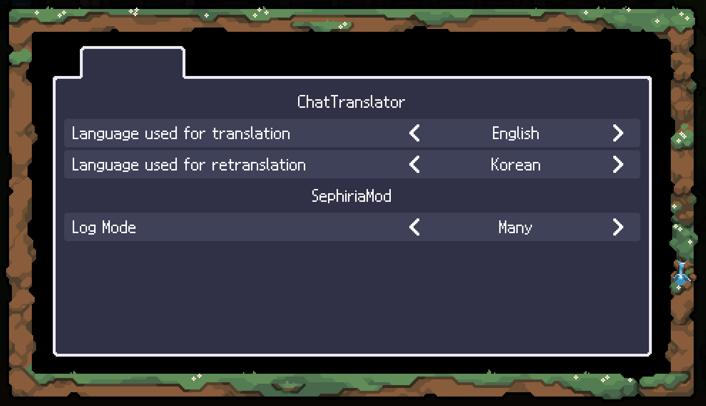

# ChatTranslator

## 📌 概要

Team Horay の <a href="https://store.steampowered.com/app/2436940/_/">Sephiria</a> のチャットに機械翻訳された文章を追加で表示します。

緑色で表示されている文章が翻訳された文章です。

<a href="https://github.com/Mira090/SephiriaModList">Sephiria ModOptions</a>を使用することで、翻訳する言語を設定できます。
再翻訳の言語を設定すると、緑色で表示された文章がさらに別の言語に翻訳され、赤色で表示されます。

## 📥 インストール
1. <a href="https://github.com/LavaGang/MelonLoader">MelonLoader v0.7.1</a> をSephiriaにインストールしてください。
2. Releases から最新の `SephiriaChatTranslator-1.X.X.zip` をダウンロードし、解凍してください。
3. `Program Files (x86)\Steam\steamapps\common\Sephiria\Mods` フォルダ内に `SephiriaChatTranslator.dll` を配置します。
4. ゲームを起動すると自動的に反映されます。

## 📝 注意事項
- このリポジトリおよびその貢献者は、Sephiria、Team Horay、または関連団体とは一切関係がありません
- このModはオフラインでは使用できません。
- 翻訳後の文章は他のプレイヤーには送信されず、Modを入れているプレイヤーにのみ表示されます。
